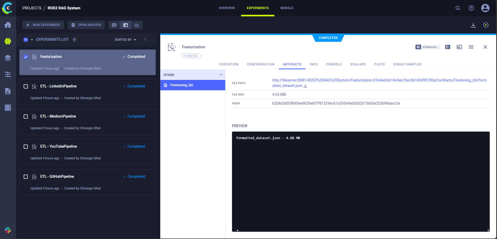
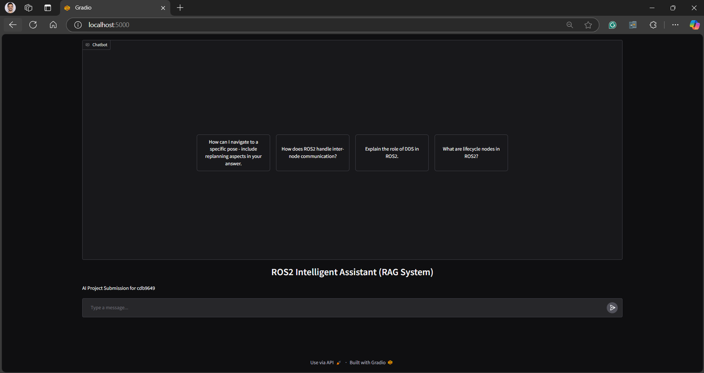
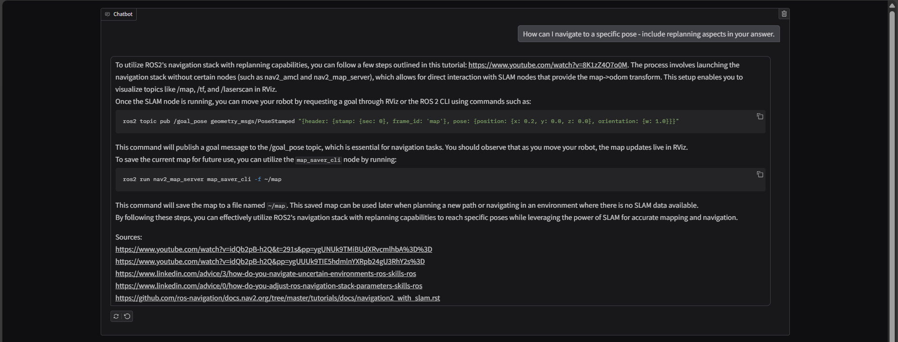

# AI Project Submission for Chirangivi Bhat

NetID: cdb9649  
Huggingface Model: [ROSLlama-GGUF](https://huggingface.co/Chinnu1103/ROSLlama-GGUF?local-app=ollama)  

---

### Pipelines:
- **ETL Pipeline**: Extract, transform, and load data for processing aross various ROS2 documentation source.
- **Featurization Pipeline**: Generate and preprocess features, including QA pair generation using ChatGPT API.
- **Fine-tuning Pipeline**: Fine-tune the model on a specific dataset using Huggingface and Weights & Biases (W&B).
- **App Deployment Pipeline**: Deploy the fine-tuned model as a local web application for interactive querying along with a list of sources in the LLM answer.

---

### Initial Steps
1. **Install Docker**: [Download and Install Docker](https://www.docker.com/get-started/).
2. **Add GitHub Token**:
   - Open the `docker-compose.yml` file.
   - Replace `GITHUB_TOKEN` with your personal GitHub token.
3. **Start Docker Containers**:
   ```bash
   docker-compose up -d
   ```
4. Wait for a few minutes after all services are up to initialize ClearML services.
5. **Set up the 'app' container in VSCode**:
   - Open the 'app' container inside VSCode.
   - Install **Python** and **Jupyter** extensions for this container.
6. **Create a ClearML User**:
   - Navigate to `localhost:8080`.
   - Clear cookies for `localhost` and `ClearML` if used previously.
   - Create a new user and go to **Settings → Workspace → New Credentials**.
   - Copy the **API Access Key** and **API Secret Key** for later use.

---

## **Pipeline Execution**

### **I. ETL Pipeline**
1. Open `01_etl_pipeline.ipynb` in VSCode.
2. Paste your ClearML **Access Keys** into the respective code cells.
3. Run the entire notebook to complete the ETL process.

---

### **II. Featurization Pipeline**
1. Open `02_featurization_pipeline.ipynb` in VSCode.
2. Add your **ChatGPT API Key** for QA pair generation.
3. Paste your ClearML **API Keys** into the respective code cells.
4. Run the entire notebook to complete the featurization process.

---

### **III. Fine-tuning Pipeline**
1. Open the `03_finetuning_pipeline_COLAB.ipynb` notebook in Google Colab with a **GPU** runtime.
2. Run the entire notebook.
3. Enter the **W&B** and **Huggingface API Keys** when prompted.

---

### **IV. App Deployment Pipeline**
1. Open the `04_app_deployment.ipynb` notebook.
2. Run the entire notebook to deploy the application.
3. Access the application in your browser at `localhost:5000` and interact with the LLM.

---

## **Additional Information**

### **ClearML Dashboard**
- View and track all runs and experiments at `localhost:8080`.

---

## **Sample Screenshots**

### ClearML Dashboard


### App Interface



Note: All other screenshots are present in `screenshots` folder