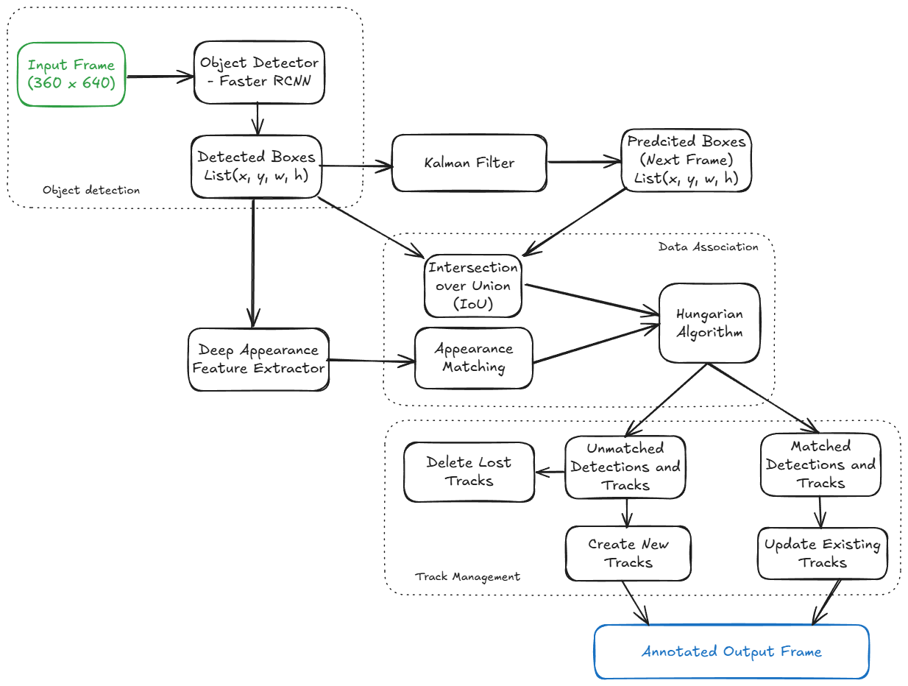

## Student Name and ID - Chirangivi Bhat (cdb9649)
## Name of the Assignment - Assignment 3
## Date of Submission - 11/17/2024

### Submission files:
1. 05-assignment-3.ipynb - Main submission
2. faster_rcnn_output_video.mp4 - Output video after applying Faster RCNN object detection
3. deepsort_output_video.mp4 - Output Video after applying
4. deepsort_architecture.png - Deep-SORT Architecture Diagram

### DeepSort Architecture

### Instructions to run the code:
1. In the docker container, select the appropriate kernel with all the dependencies
2. Run all the cells in 05-assignment-3.ipynb
